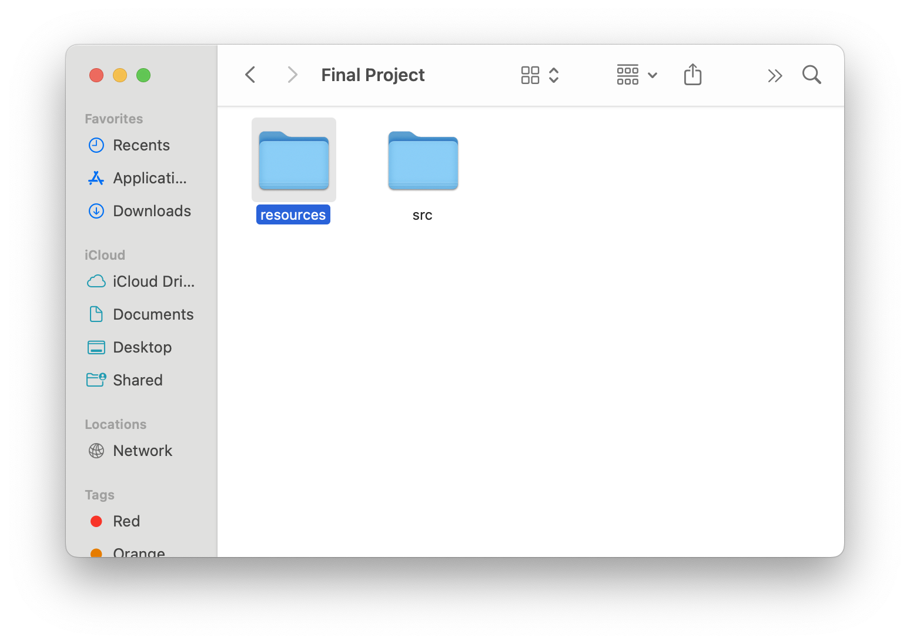
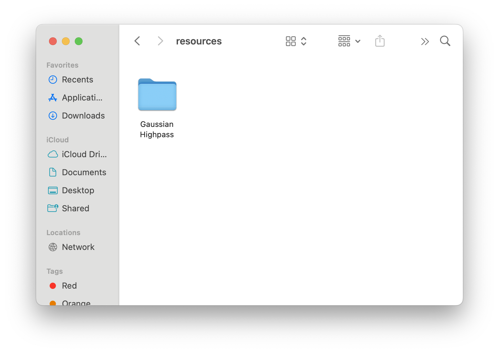
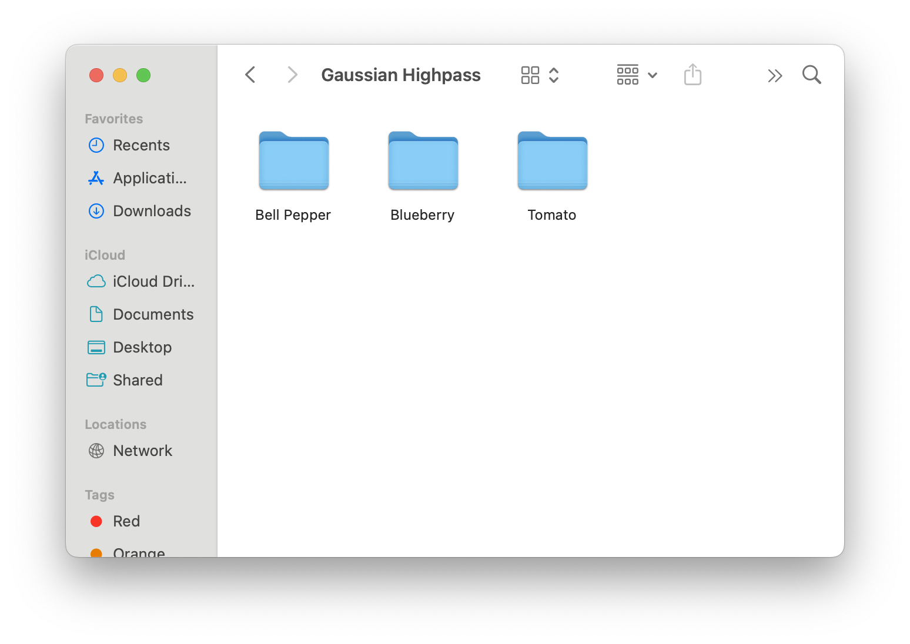
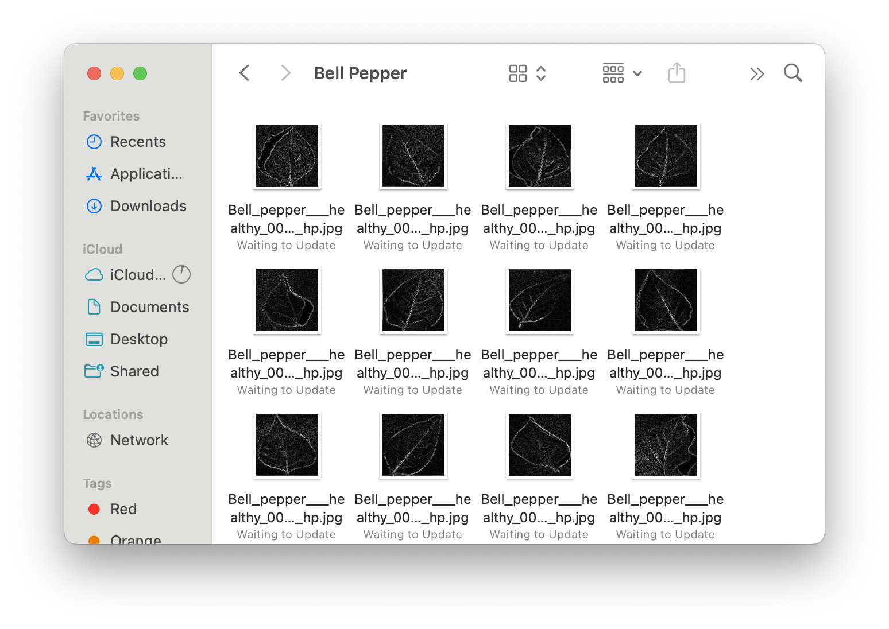

# DatFinalProject
Final Project Machine Learning

# Loading the Dataset
Vikas gave us a function that already loads and preprocesses the dataset, but it is very important that the folders are setup properly to allow for the proper loading.

I have my project set up into two folders:  

Within the `resources/` directory, I have a folder with all my filtered images (I have Gaussian Highpass).  

To allow for compatability with Vikas' given functions, I separated each classification into separate folders:  

Within each classification folder is a collection of all of those images  

